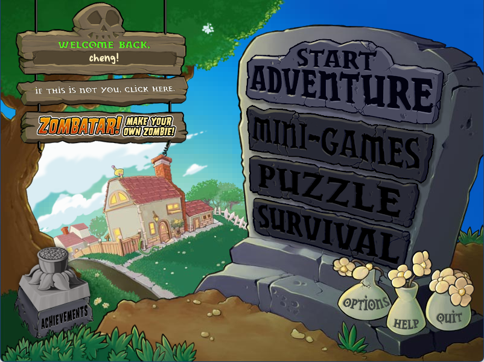
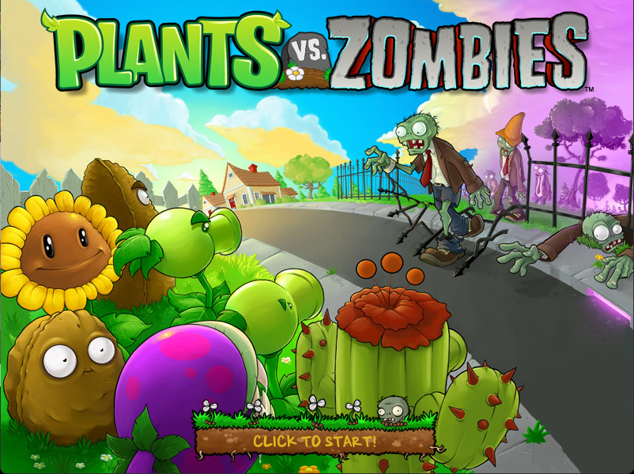
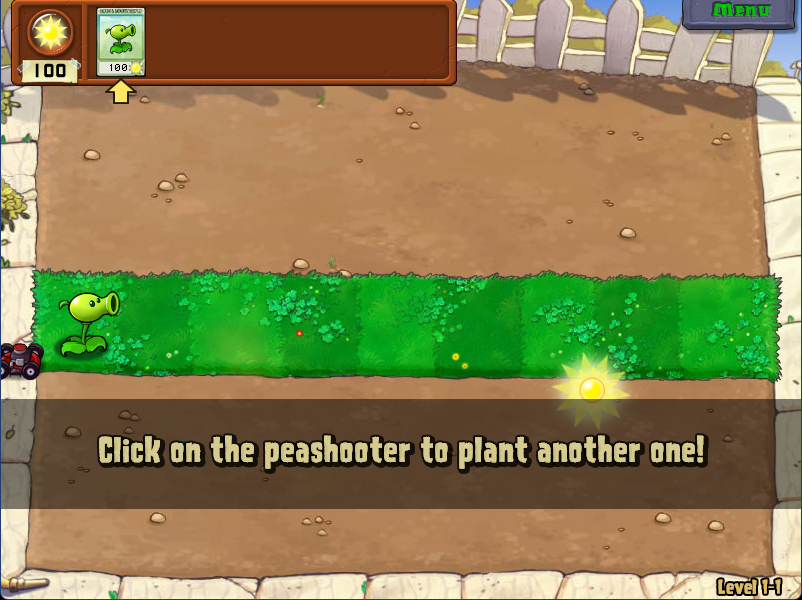
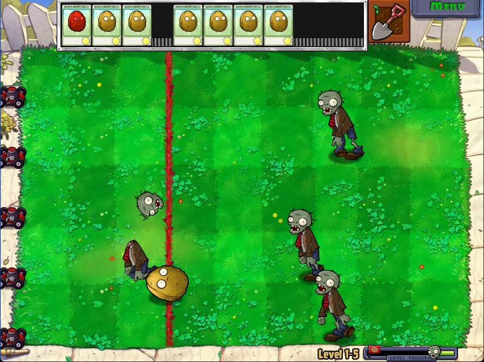
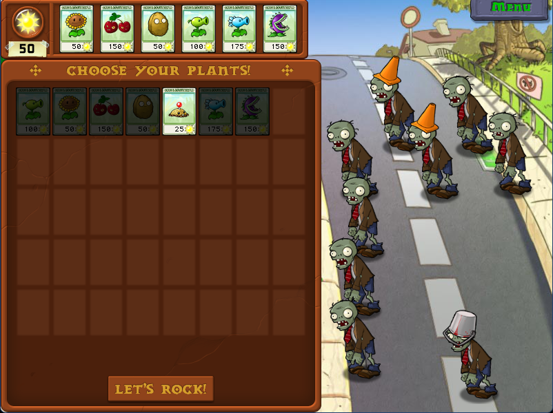
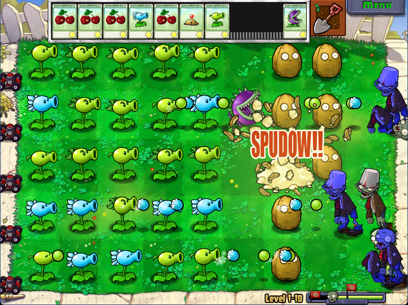
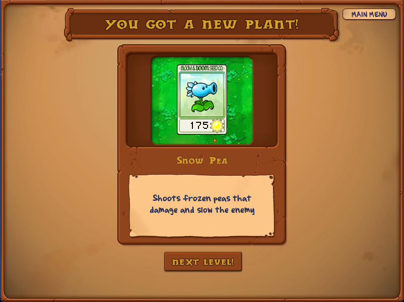

  <h1>PvZ Remake</h1>
  
一个使用 TypeScript 和 Cocos Creator 重制原版 Plants vs. Zombies 冒险体验的项目。

  

    
    
    
    
    
    
  

## 项目简介

**PvZ Remake** 使用 Cocos Creator 重建原版 Plants vs. Zombies 的核心体验，重点还原玩法节奏、UI 流程、动画播放、音频行为，以及 Web/mobile 运行时支持。

本仓库只包含源码，不包含原版 Plants vs. Zombies 资源。

  

## 截图

<table>
  <tr>
    <td></td>
    <td></td>
    <td></td>
  </tr>
  <tr>
    <td align="center">加载界面</td>
    <td align="center">冒险 1-1</td>
    <td align="center">冒险 1-5</td>
  </tr>
  <tr>
    <td></td>
    <td></td>
    <td></td>
  </tr>
  <tr>
    <td align="center">冒险 1-8</td>
    <td align="center">冒险 1-10</td>
    <td align="center">新植物奖励</td>
  </tr>
</table>

## 在线试玩

Web 版已发布在：

  <a href="https://plants-vs-zombies.cc"><strong>plants-vs-zombies.cc</strong></a>

项目基于 Cloudflare Pages 静态托管。首次加载需要下载并缓存游戏资源，耗时可能较长，请在加载界面耐心等待。

## 功能特性

### 游戏还原

- [x] 冒险模式进度：`1-1` 到 `1-10`
- [x] 白天草坪战斗循环：卡槽、阳光收集、植物种植、子弹、僵尸波次、旗帜波、小推车、胜利奖励和失败流程
- [x] 已实现植物：豌豆射手、向日葵、樱桃炸弹、坚果墙、土豆雷、寒冰射手、大嘴花和双发射手
- [x] 已实现僵尸：普通僵尸、旗帜僵尸、路障僵尸、铁桶僵尸和撑杆僵尸
- [x] 原版风格 UI 流程：PopCap/启动加载、用户选择、选卡界面、游戏内菜单、选项、帮助、奖励界面和关卡进度条
- [x] 部分原版模式界面：图鉴和挑战模式选择界面
- [x] 从原版资源转换动画、粒子、音效、音乐、字体和 LawnStrings
- [x] 用户档案、冒险进度、金币、设置和关卡内快照存档
- [ ] 后续世界内容还原
- [ ] 小游戏、解谜、生存以及后期系统
- [ ] 商店、禅境花园和成就系统完善

### 独立添加功能

- [x] 爆炸坚果：150 阳光消耗，耐久与坚果墙相同，被啃咬死亡后产生 3x3 范围爆炸；目前只能通过 Debug CLI 指令种植
- [x] 面向浏览器和移动端的运行时支持，包括移动端全屏处理和触控操作
- [x] Debug CLI：支持关卡跳转、生成实体、胜利/失败/重开、游戏速度、快捷键、碰撞框、性能开关、音频设置和背景显示控制
- [x] 宽屏两侧背景和对应的 debug 开关
- [x] 使用 TypeScript 实现的动画播放、粒子渲染、音乐分轨播放、持久化和资源加载系统
- [x] 针对合法拥有的原版 PvZ 文件提供一键资源导入管线
- [ ] 大范围设备和浏览器兼容性验证
- [ ] 优化 iOS native 运行性能，降低卡顿、内存压力和渲染开销
- [ ] 增加 i18n 支持，将剩余硬编码 UI/debug 文本迁移到语言资源，并支持运行时语言切换
- [ ] 导入原版存档数据，读取合法拥有的 PvZ 原版存档，并映射玩家档案和进度数据
- [ ] 使用 Godot 完全重构项目，整理更适合长期维护的运行时架构

## 文档

- [Development Guide](docs/DEVELOPMENT.md)
- [中文开发说明](docs/DEVELOPMENT.zh-CN.md)
- [Debug CLI 说明](docs/DEBUG_CLI.zh-CN.md)
- [开源协议](LICENSE)

## 鸣谢

- [Electr0Gunner/PvZ-Quality-of-the-Lawn-Decompile](https://github.com/Electr0Gunner/PvZ-Quality-of-the-Lawn-Decompile)
- [wszqkzqk/PvZ-Portable](https://github.com/wszqkzqk/PvZ-Portable)
- 宝开游戏，感谢其创作原版 Plants vs. Zombies

## 免责声明

这是一个非官方 fan remake 项目。

本仓库不包含原版 Plants vs. Zombies 的资源、音乐、音效、图片、名称或其他受版权保护的游戏内容。这些材料的版权归各自权利方所有。

如需在本地运行项目，你必须自行提供合法获得的原版游戏文件，并使用本项目提供的导入工具生成本地运行资源。

本项目与 PopCap Games、Electronic Arts 或任何相关权利方无从属、认可、赞助或授权关系。

## 开源协议

本仓库中的源码基于 [MIT License](LICENSE) 开源。该协议仅适用于本仓库中的源码和项目文件。
